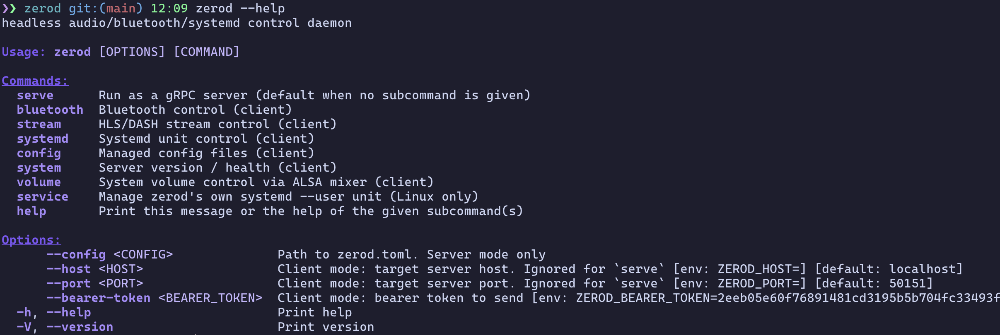

# zerod
[](https://github.com/tsirysndr/zerod/actions/workflows/release.yml)



Headless audio + Bluetooth + systemd control daemon for Linux audio appliances
(Raspberry Pi, single-board computers running Snapcast, shairport-sync,
squeezelite, …). One binary, one gRPC port, one TOML file.

`zerod` is both:

- a **server** — exposes a gRPC API over `tonic` to control BlueZ, play HLS /
  MPEG-DASH audio streams to a configurable sink (cpal / stdout / pipe), drive
  systemd units, and remotely read/write a fixed set of config files.
- a **client CLI** — talks to another `zerod` over the same gRPC API.

Same binary on both ends. Run `zerod` with no arguments and it boots the
server; run `zerod stream play …` and it acts as a client.

## Status

Early. Pre-1.0, breaking changes expected.

## Features

- **Bluetooth** — scan / list / pair / connect / disconnect / remove over
  BlueZ (Linux-only via `bluer`). Non-Linux builds compile but return
  `Unimplemented`.
- **A2DP sink (Pi-as-speaker)** — registers a BlueZ pairing agent so phones
  can pair with the daemon, then delegates the audio path to
  `bluealsa-aplay` via the existing systemd allowlist. Pairing prompts
  surface as events; resolve them with `RespondPairing` or set
  `auto_accept_pairings = true` for kiosk mode. Linux-only.
- **HLS / MPEG-DASH player** — fetch + demux + decode (symphonia) → S16LE PCM.
  Three sinks selectable per `Play` call:
  - `cpal` — default audio device (or a named device)
  - `stdout` — raw interleaved S16LE little-endian PCM on stdout
  - `pipe` — same, into a named FIFO (auto-reopens on broken pipe)
- **Spotify Connect** — spawns `librespot --backend pipe` and pipes its
  S16LE stdout through the same sink as HLS/DASH. The phone picks the
  daemon's `[librespot].name` from its Devices list. Linux-only; requires
  `librespot` installed on the device (`apt install librespot`).
- **Snapcast control** — JSON-RPC 2.0 client to a local `snapserver` over
  TCP. List/rename clients, move them between groups, set per-client
  volume and latency. Push notifications from snapserver flow back onto
  the event bus so external `snapctl` changes don't go invisible.
- **Systemd control** — start / stop / restart / reload / enable / disable /
  status via the system D-Bus, restricted to an allowlist. Linux-only.
- **Volume control** — get / set volume and mute / unmute against any ALSA
  selem (Master, PCM, …) on any card via `alsa-lib`. Works on bare ALSA and
  on PipeWire/PulseAudio via ALSA-mixer emulation. Linux-only. Plus a
  per-stream software gain applied in the player loop for the HLS/DASH
  session, independent of the system mixer.
- **Server-streaming events** — `EventsService.Subscribe(kinds)` fans out
  state transitions (stream playback, BT pairing prompts, BT
  connect/disconnect, systemd unit state, ALSA volume, snapcast client
  changes) without polling. Lossy under backpressure — slow subscribers
  see a `LaggedEvent` rather than a closed stream. `zerod events tail
  [--filter ...]` prints one JSON line per event.
- **Remote config edit** — atomic read/write of a fixed set of files
  (`snapserver.conf`, `shairport-sync.conf`, …), with an optional
  reload-or-restart of the bound unit on every write.
- **Auth** — bearer token. Three sources, in order: `zerod.toml`,
  `ZEROD_BEARER_TOKEN` env var, or a 32-byte random one generated and logged
  at startup.
- **mDNS / zeroconf discovery** — the server advertises itself as
  `_zerod._tcp.local.`, so clients on the same LAN can find it without
  `--host`. `zerod discover` lists every responder. Pure-Rust, no Avahi
  or Bonjour dependency.
- **Reflection** — `tonic-reflection` is wired up, so `grpcurl
  -plaintext localhost:50151 list` works out of the box.

## Install

### With Homebrew

```
brew install tsirysndr/tap/zerod
```

Works on macOS (Apple Silicon and Intel) and Linuxbrew.

### From a release tarball

Every tagged release (`v*` tag on `main`) publishes prebuilt binaries
for these triples:

| Platform                                 | Tarball                                         |
| ---------------------------------------- | ----------------------------------------------- |
| macOS Apple Silicon                      | [`zerod-aarch64-apple-darwin.tar.gz`][dl-mac-a] |
| macOS Intel                              | [`zerod-x86_64-apple-darwin.tar.gz`][dl-mac-x]  |
| Linux x86_64 (NUC, server, …)            | [`zerod-x86_64-unknown-linux-gnu.tar.gz`][dl-x] |
| Linux ARM64 (Pi 3/4/5, 64-bit SBCs)      | [`zerod-aarch64-unknown-linux-gnu.tar.gz`][dl-a]|
| Linux ARM v6/v7 (Pi 1 / Zero / Pi OS 32) | [`zerod-arm-unknown-linux-gnueabihf.tar.gz`][dl-r] |

[dl-mac-a]: https://github.com/tsirysndr/zerod/releases/latest/download/zerod-aarch64-apple-darwin.tar.gz
[dl-mac-x]: https://github.com/tsirysndr/zerod/releases/latest/download/zerod-x86_64-apple-darwin.tar.gz
[dl-x]:     https://github.com/tsirysndr/zerod/releases/latest/download/zerod-x86_64-unknown-linux-gnu.tar.gz
[dl-a]:     https://github.com/tsirysndr/zerod/releases/latest/download/zerod-aarch64-unknown-linux-gnu.tar.gz
[dl-r]:     https://github.com/tsirysndr/zerod/releases/latest/download/zerod-arm-unknown-linux-gnueabihf.tar.gz

```
curl -L https://github.com/tsirysndr/zerod/releases/latest/download/zerod-aarch64-unknown-linux-gnu.tar.gz | tar xz
sudo install zerod-aarch64-unknown-linux-gnu/zerod /usr/local/bin/
```

Each archive ships `zerod` plus `README.md`, `LICENSE`, and
`zerod.toml.example`, and is accompanied by a `.sha256` checksum file.

### From source

Native build (whatever host you're on):

```
cargo build --release
```

System dependencies on Linux: `protoc` (≥ 3.15), `libasound2-dev`,
`libdbus-1-dev`, `pkg-config`.

### Cross-compiling

`Cross.toml` + a per-target `Dockerfile.<triple>` are checked in. Each
Dockerfile pins protoc 25.1 (the cross base images ship a protoc too old
for proto3 `optional`) and installs the multiarch ALSA / D-Bus dev libs.

| Use case                                 | Triple                        | Command                                                      |
| ---------------------------------------- | ----------------------------- | ------------------------------------------------------------ |
| Raspberry Pi 1 / Zero / 2 / Pi OS 32-bit | `arm-unknown-linux-gnueabihf` | `cross build --release --target arm-unknown-linux-gnueabihf` |
| Raspberry Pi 3 / 4 / 5 / 64-bit ARM SBCs | `aarch64-unknown-linux-gnu`   | `cross build --release --target aarch64-unknown-linux-gnu`   |
| Generic Linux x86_64 (NUC, server, …)    | `x86_64-unknown-linux-gnu`    | `cross build --release --target x86_64-unknown-linux-gnu`    |

After a successful build the binary lands at
`target/<triple>/release/zerod` — scp it to the device, drop a
`zerod.toml` next to it (or at `/etc/zerod.toml`), and run.

If you edit a Dockerfile, force `cross` to rebuild the image with
`CROSS_REBUILD=1 cross build …` (cross caches the image per-target).

## Configuration

Settings live in `zerod.toml`. Search order:

1. path passed via `--config`
2. `./zerod.toml`
3. `$XDG_CONFIG_HOME/zerod/zerod.toml` (or `~/.config/zerod/zerod.toml`)
4. `/etc/zerod.toml`

See `zerod.toml.example` for the full schema. Minimal example:

```toml
[server]
bind         = "0.0.0.0:50151"   # all interfaces; use "127.0.0.1:50151" for loopback only
bearer_token = ""                # empty → ZEROD_BEARER_TOKEN env → random

[systemd]
units = ["snapserver.service", "shairport-sync.service"]

[[configs]]
key  = "snapserver"
path = "/etc/snapserver.conf"
unit = "snapserver.service"
```

If no `zerod.toml` is found, `zerod` runs with defaults (bind
`0.0.0.0:50151`, no systemd allowlist, no managed configs) and emits a
warning.

## Usage

### Server

```
zerod                                       # default; reads zerod.toml
zerod serve --config /etc/zerod.toml        # explicit
ZEROD_BEARER_TOKEN=hunter2 zerod            # fixed token via env
```

Bind / token / allowlist come from `zerod.toml`. A randomly-generated token
is printed once at startup if nothing is configured.

### Client

With no `--host`, the client browses mDNS (`_zerod._tcp.local.`) for ~1.5s
and connects to the only responder. If multiple servers reply, you get a
listing and the command exits non-zero — pin one with `--name` (the server
hostname, or whatever you set as `[mdns].name` in `zerod.toml`). Pass
`--host` (or `ZEROD_HOST`) to bypass discovery entirely.

Each global flag also reads from an env var so you can pin the target once
per shell session and skip the flags entirely:

| Flag                     | Env var                     |
| ------------------------ | --------------------------- |
| `--host`                 | `ZEROD_HOST`                |
| `--port`                 | `ZEROD_PORT`                |
| `--bearer-token`         | `ZEROD_BEARER_TOKEN`        |
| `--name`                 | `ZEROD_NAME`                |
| `--discover-timeout-ms`  | `ZEROD_DISCOVER_TIMEOUT_MS` |

```
# No host needed — the daemon is found via mDNS.
export ZEROD_BEARER_TOKEN="$(cat ~/.zerod-token)"
zerod systemd status snapserver.service

# List every zerod on the LAN.
zerod discover

# Two daemons on the LAN? Pick one by name (matches [mdns].name).
zerod --name living-room-pi system health

# Skip mDNS entirely.
export ZEROD_HOST=pi.lan
zerod systemd status snapserver.service
```

```
zerod bluetooth scan --timeout-secs 5
zerod bluetooth connect AA:BB:CC:DD:EE:FF
zerod bluetooth discoverable on --timeout 60
zerod bluetooth respond-pairing AA:BB:CC:DD:EE:FF --accept

zerod stream play https://example.com/audio.m3u8 --output cpal
zerod stream play https://example.com/audio.mpd --output pipe --pipe-path /tmp/audio.pcm
zerod stream spotify start                 # advertise as a Spotify Connect device
zerod stream spotify stop
zerod stream status                        # state, source (Hls/Dash/Spotify), output, volume
zerod stream stop

zerod a2dp enable                          # start bluealsa-aplay + flip discoverable
zerod a2dp disable

zerod systemd list
zerod systemd restart snapserver.service

zerod snapcast clients                     # list every snapclient across all groups
zerod snapcast volume aa:bb:cc:dd:ee:ff 30
zerod snapcast group-mute g1 true
zerod snapcast group-stream g1 default

zerod events tail                          # subscribe to every event, one JSON line each
zerod events tail --filter stream.state    # only stream playback transitions
zerod events tail --filter 'bt.*'          # all bluetooth events (quote the wildcard)

zerod volume list                          # all ALSA selems on default card
zerod volume get                           # Master on default card
zerod volume set 70                        # Master → 70%
zerod volume set 50 --control PCM          # specific control
zerod volume mute
zerod volume unmute

zerod stream volume set 80                 # per-stream gain (HLS/DASH/Spotify session)
zerod stream volume get

zerod config list
zerod config get snapserver
zerod config put snapserver ./snapserver.conf --action restart

zerod --bearer-token "$(cat ~/.zerod-token)" systemd status snapserver.service
```

### gRPC directly

```
grpcurl -plaintext localhost:50151 list
grpcurl -plaintext -H 'authorization: Bearer …' \
  -d '{"timeout_secs": 5}' localhost:50151 zerod.v1alpha1.BluetoothService/Scan
```

## Security

There is intentionally no TLS in v1. The default bind is `0.0.0.0:50151`
(all interfaces) so the daemon is reachable from your LAN out of the box —
which means the bearer token is the only line of defence against any host on
that network. Always set `bearer_token` in `zerod.toml` (or
`ZEROD_BEARER_TOKEN`) instead of relying on the random one logged at
startup, especially when running unattended. For cross-internet access put
`zerod` behind WireGuard / Tailscale / an SSH tunnel rather than punching
the port through your router. If you only ever drive `zerod` locally, flip
the bind back to `127.0.0.1:50151`.

Systemd actions and config writes are gated by the allowlist in `zerod.toml`
— `zerod` cannot be turned into a generic remote `systemctl`.

## Layout

```
zerod/
├── Cargo.toml                          # workspace root, also the binary
├── src/main.rs                         # clap CLI (server + client modes)
├── zerod.toml.example
├── Cross.toml
├── Dockerfile.arm-unknown-linux-gnueabihf
└── crates/
    ├── proto/      # tonic_build over .proto files (zerod.v1alpha1)
    ├── bluetooth/  # bluer wrapper + pairing agent (target_os="linux" gated)
    ├── stream/     # HLS/DASH + librespot source + AudioSink trait + 3 sinks
    ├── systemd/    # zbus systemd1 client (target_os="linux" gated)
    ├── config/     # ManagedConfig registry, atomic write
    ├── discovery/  # mDNS register + browse over mdns-sd
    ├── events/     # broadcast event bus shared by every subsystem
    ├── snapcast/   # JSON-RPC 2.0 client over TCP to snapserver
    └── server/     # tonic services + settings loader + bearer interceptor
```

## License

MIT. See [LICENSE](LICENSE).
